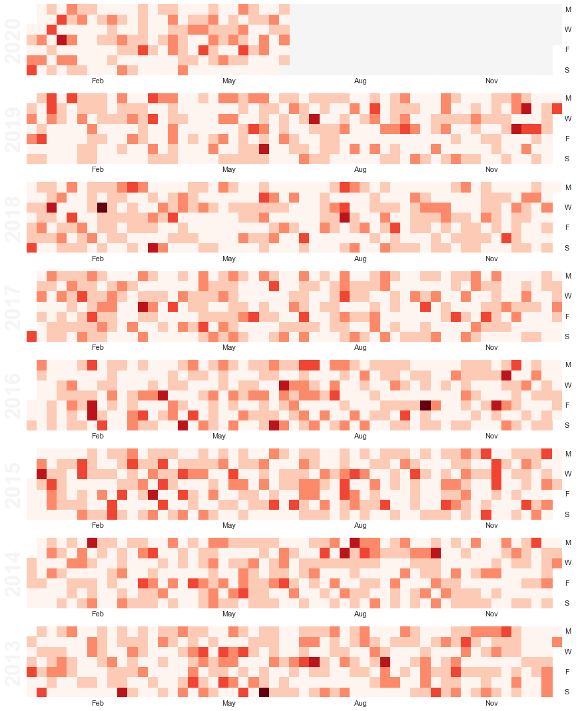

# udacity_datascientist_policeviolence
 As for the latest protests against police violence, I want to support the strongly needed actions upon this by providing data to proof urgency.

 That's why I had a look at 3 datasets from the research collaborative [Mapping Police Violence](https://mappingpoliceviolence.org/).

 You can find all data preparation, wrangling and anylsis in the `police_violence.ipynb` Jupyter Notebook.
 Although I preferred to directly extract the data from an URL source, I have put an extract of the data used into the `data` folder.

I also wrote a blog article including my findings from this analysis, which you can find [here](https://medium.com/@keanu.forthmann/mapping-police-violence-the-unjust-violence-will-not-diminish-bd3a02014ddc).

--

This is a calendar view where the number of killings of black people by police. You can find other images out of the notebook within the `images`folder.

